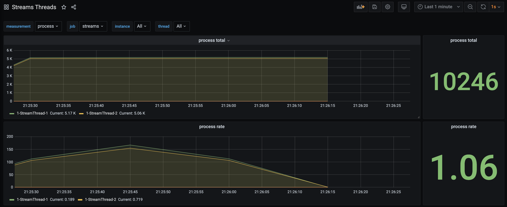

# Kafka Streams Dashboards

* Showcases the monitoring of Kafka Streams Metrics

* This is the code and dashboards as the basis of a Kafka Summit Europe 2021 presentation titled,
[What is the State of my Kafka Streams Application? Unleashing Metrics.](https://www.kafka-summit.org/sessions/what-is-the-state-of-my-kafka-streams-application-unleashing-metrics).

* Leverages Docker and Docker Container extensively

* Containers and Build is with Java 14, but Java 11 would work just fine (changing the build.gradle script accordingly)

## TL;TR

* Setup and Configuration all in the `./scripts/startup.sh` script; execute from root directory to get everything running.

* Shut it all down, use `./scripts/teardown.sh` script.

* Grafana Dashboard 

  * `https://localhost:3000`
  * Credentials:
    * username: `admin`
    * password: `grafana`

  * on MacOS your the grafana dashboard will auto open in your default browser.

### Kafka Streams Threads Dashboard


## Docker 

* This project leverages docker and docker compose for easy of demonstration.

* to minimize having to start up all components, separate `docker-compose.yml` for each logical-unit and a common bridge network `ksd`.

* docker compose .env files used to keep container names short and consistent but hopefully not clash with any existing docker containers you are using.

* Kafka Brokers name/ports

  | broker   | internal (container) bootstrap-servers | external (host-machine) bootstrap-servers |
  |---|---|---|
  | broker-1 | broker-1:9092 | localhost:19092                        |
  | broker-2 | broker-2:9092 | localhost:29092                        |
  | broker-3 | broker-3:9092 | localhost:39092                        |
  | broker-4 | broker-4:9092 | localhost:49092                        |

* The Kafka applications can run on the host machine utilizing the external names, the applications
can run in containers using the internal hostnames.

  * Run the application within a container with internal configruation, so it can be part of the Grafana dashboard, since
prometheus is running in a container and does have access to the host-name endpoint.

  * Run the applications externally for development or experimentation of the application

  * Each project will build a Docker image that then can be started with the 'applications' docker-compose.
  
## OpenSource libraries

* The primary software libraries used in addition to Apache Kafka Client and Streams Libraries.

  * FasterXML Jackson

  * Lombok

  * JCommander

  * Slf4j API

  * Logback

  * Apache Commons
    * lang3
    * csv


## Tools

The tools project provides custom deserializers to use to inspect key elements on a change-log topic.

* `scripts/enable-custom-tools-derserialer` will create a symbolic link to the tools jar file. This allows
for `kafka-console-consumer` to utilize those deserializers.  Inspect the script before running, to understand
the modification it will do (expecially if your installation of Apache Kafka is not Confluent's.)

```
kafka-console-consumer \
   --bootstrap-server localhost:19092 \
   --property print.timestamp=true \
   --property print.partition=true \
   --property print.key=true \
   --property key.separator=\| \
   --key-deserializer=io.kineticedge.ksd.tools.serde.SessionDeserializer \
   --topic analytics_session-SESSION-aggregate-purchase-order-changelog
```