# Kafka Streams Dashboards

## TL;TR
* Setup and Configuration all in the `./scripts/startup.sh` script; execute from root directory to get everything running.
* Select `(1) cluster-1` or `(2) cluster` for your first exploration of this project.
* Goto [localhost:3000](http://localhost:3000) to explore the dashboards.
  * you shouldn't need to log in, but if you need to the username is `admin` and the password is `grafana`.
* Goto [localhost:8888](http://localhost:8888) to explore the contents of the aggregates.
* `./scripts/teardown.sh` will shut everything (regardless of which cluster was selected) and will also remove all volumes.

## Overview
This project showcases Kafka Stream Metrics by deploying 2 types of applications and then dashboards available to monitor them.

## Purchase Order Application

The first application is a *purchase order* system that takes orders, attaches stores and users, and prices them, and emits
the result as a *pickup order*. This showcases KTables, Global KTables, Joins, aggregations, and more.

The primary stream of data flowing for purchase-order is shown in this diagram. The topology to hydrate and use the tables, is not shown.
This is a logical representation of the topology based on the DSL components, the actual topology built includes additions source and
sink nodes to handling the re-key process. 

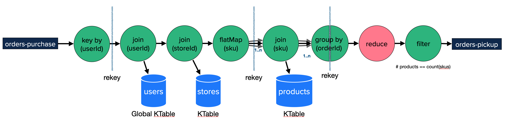

The reason for the *group by (orderId)* being split with a re-key is that is indeed what happens when the logical DSL topology is built
by the StreamsBuilder. It is important to understand that here, expecially since it is this topic that is then leveraged for analytics.

## SKU Analytic Application

The second application is analytics on the SKU purchased in those orders. When the order/item message (when skus are priced) are joined
back to the order, this application listens on that topic and extracts information to keep track of SKUs purchased over a given period of time (window).

It tracks the re-keyed order by SKU and builds up windowed analytics. This includes all window types: `tumbling`, `hopping`, `sliding`, `session`, and 
even `none` as a non-window deployment. These aggregations are tracking the quantity purchased on the given SKU for the given type of window. Now, from 
a real-world use-case scenario, I wouldn't use `session` windows for such aggregation; but having the same application with all
windowing options makes it a lot easyer to see and compare the metrics between them.

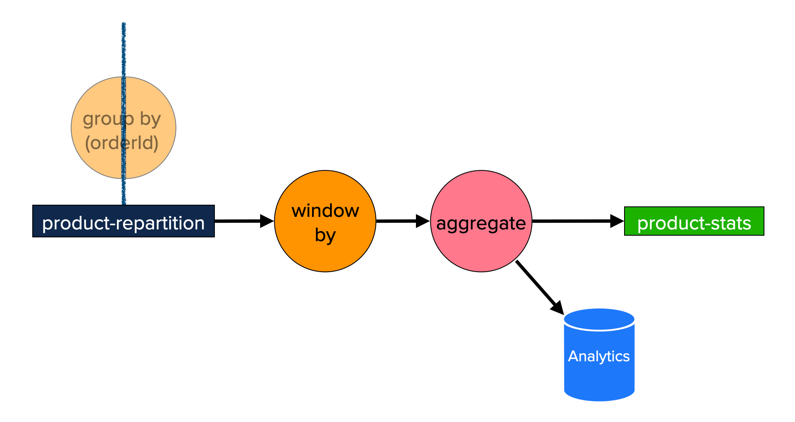

## Details (not just a TL;TR)

This project:
* Extensively leverages Docker and Docker Compose.
* Applications are built with Java 17 and run on a Java 17 JVM.
* Kafka leverages Confluent Community Edition containers, which run with a Java 11 JVM.
* Has Grafana dashboards for Kafka Cluster, Kafka Streams, Consumer, Producer, and JVM.
  * Supports a variety of cluster configurations to better showcase the Kafka Cluster metrics and validate dashboards are build
with the various options.

* Setup and Configuration all in the `./scripts/startup.sh` script; execute from root directory to get everything running. You
will be prompted to select an Apache Kafka Cluster to start. Typically, I suggest `(2) cluster` is having more brokers is more
realistic experience, but if you have limited memory/cpu on your machine, use `(1) cluster-1`.

```
1. cluster-1       --  1 node (broker and controller)
2. cluster         --  4 brokers, 1 raft controller
3. cluster-3ctrls  --  4 brokers, 3 raft controllers
4. cluster-hybrid  --  4 brokers, 1 dedicated raft controller, 2 brokers are also kraft controllers
5. cluster-zk      --  4 brokers, 1 zookeeper controller
6. cluster-sasl    --  4 brokers with SASL authentication, 1 zookeeper controller
7. cluster-lb      --  4 brokers, 1 raft controller, an nginx lb (9092)
```

The other options are for more advance scenarios. `(3) cluster-3ctrls` is a typical deployment (3+ brokers and 3 controllers).
The hybrid `(4) cluster-hybrid` is to ensure that the Kafka Cluster dashboards correctly handle metrics "math" by having a node
that is both a `broker` and `controller` while also having nodes that are just `broker` and just `controller`. The `(5) cluster-zk` is 
to make sure the dashboards still support `zookeeper`. `(6) cluster-sasl` is to be able to check the `authentication` dashboard
provided in the Kafka Cluster dashboards, it is also to show how security works with setting up a Kafka Cluster. Be sure to generate
the certificates [readme](./cluster-sasl/certificates/README.md). The last cluster `(7) cluster-lb` has an nginx proxy for each broker that allows you to navigate
into it and use linux's traffic-controller `tc` to add network latencies. The best way to learn if your dashboards are useful, is to 
observe them when things are not going well; this provides that scenario.

### Grafana Dashboard

All of the grafana dashboards are handled with a local `Grafana` and `Prometheus` instance running from the `monitoring` module.

  * `https://localhost:3000`
  * Credentials (configuration is currently configured allowing edit access, even w/out login)
    * username: `admin`
    * password: `grafana`

### State Store UI

Both the `purchase-order` and `aggregate` applications have a simple UI allowing for innspection of the state stores.

  * `https://localhost:8888`
  * There are two pages to allow for inspection of the purchase-order state store and aggregate state store.
  * This allows for learning about state stores and windowing.

* Shutdown

  * Shut it all down, use `./scripts/teardown.sh` script. This will also remove all volumes.


## Dashboards

There are 12 Kafka Streams dashboards currently as part of this project. In addition, there are dashboards for Kafka Cluster,
Producer, Consumer, and JVM.  This documentation is focused on the Kafka Stream dashboards, but feel free to explore the
other dashboards, especially for learning or gaining ideas and examples for building dashboards for your own organizations.

### 01 - Topology

* This dashboard will give you insights into the Kafka Streams Topology along  with the instance/thread a task is assigned.
* Aids greatly in understanding the task_id (subtopology_partition) used by other dashboards.

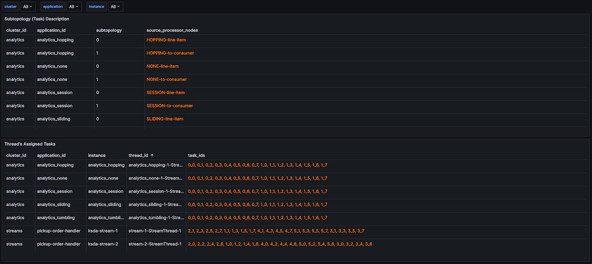

### 02 - Threads

* Process, Commit, Poll statistics on each thread.
* The graph will keep thread/instances separated while the number is total (of what is selected).

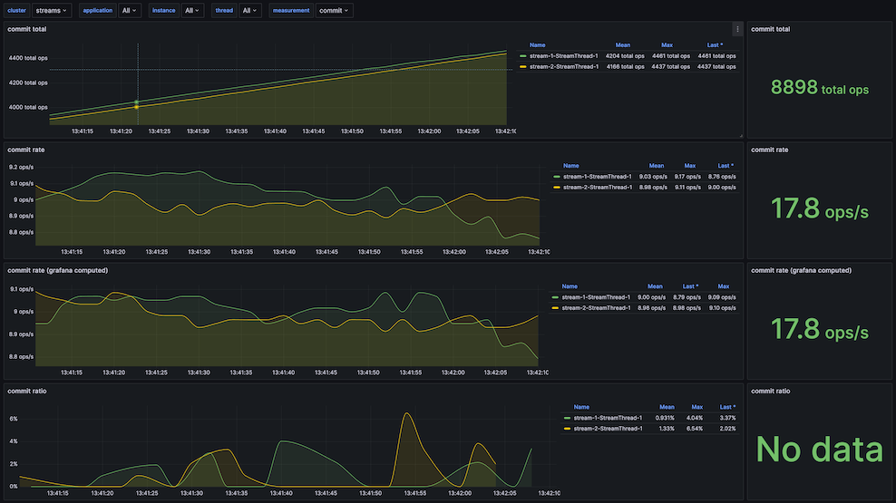

### 03 - Topic

* Since 3.3, Kafka Streams has topic rate messages for capturing bytes and messages produced and consumed for a given topic.
* This dashboard provides a top-level summary of the variable selection as well as a graphical break-down on each partition.

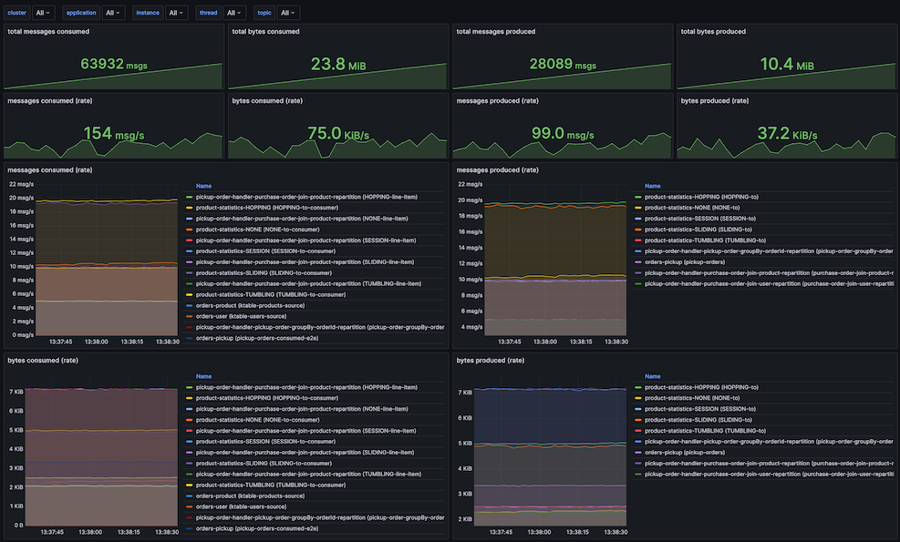

### 04 - Tasks

* It provides _processing_ information and _record_ information.

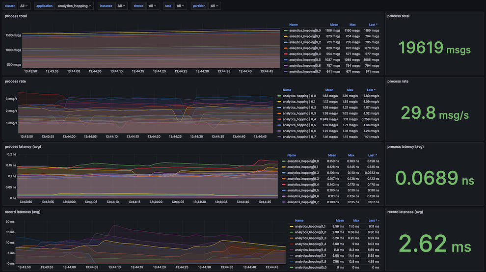

### 05 - Tasks 2E2

* Task end-to-end metrics (introduced in Kafka 2.4) showcases the e2e metrics.
* It allows for a breakdown by both sub-topology and by partition. An `application`
must be selected and is defaulted. 

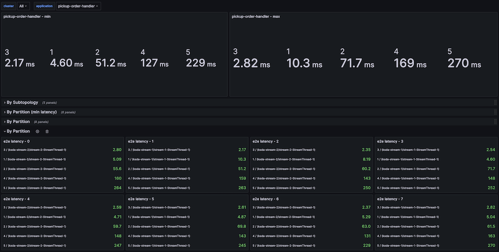

### 06 - Processes

* These are `debug` level metrics. 
* The process is selected by name, but the graphs show it by task (subtopology_partition).

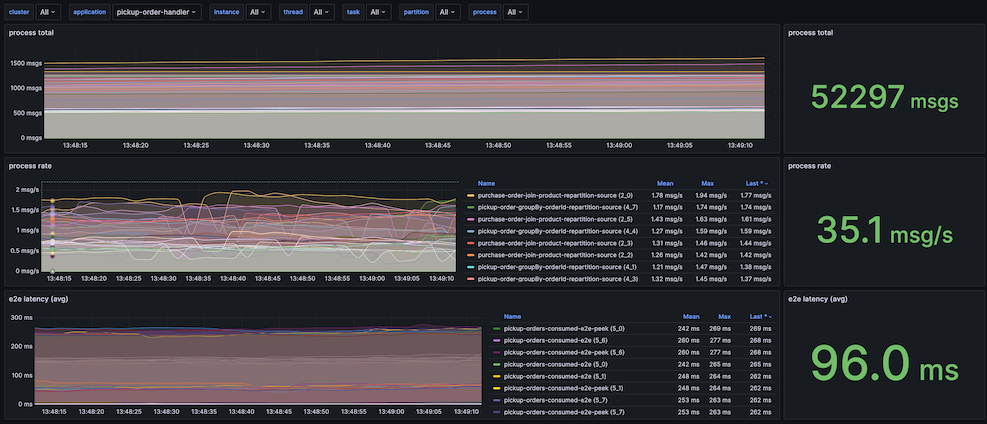

### 07 - Record Cache

* The record cache is for materialized stores that have caching enabled.
* The metric is hit-ratio (max, avg, min). 

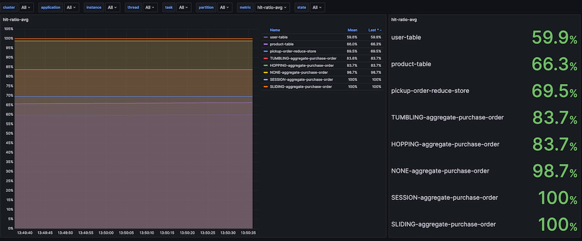

### 08 - StateStore (put/fetch/delete/size)

* Shows the put, get/fetch, delete, and count statistics into a single dashboard.
* puts _get_ and _fetch_ in the same dashboard, since implementation of the store depends
on which one is used, but only one or the other is used.
* _remove_ and _delete_ are also on the same panel, for the same reason.

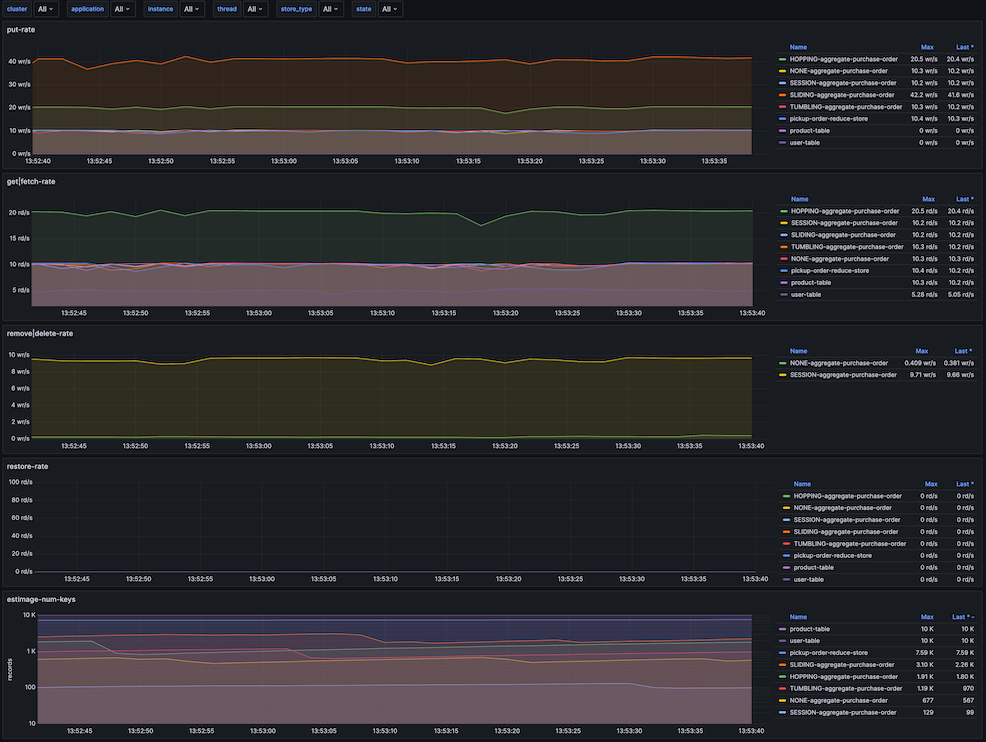

### 09 - StateStore (rate)

* The ability to view the rate metrics of the state-stores.
* `put`, `get`, `delete`, and more.


### 10 - StateStore (latency)

* The ability to view the latency metrics of the state-stores.
* `max` and `avg` latency metrics
* The same metrics as for rate, just like `put`, `get`, `delete`.

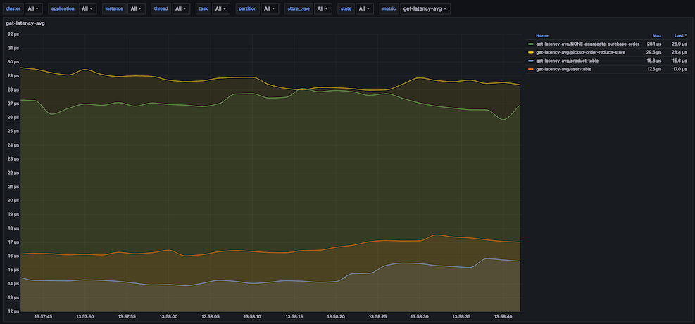

### 11 - Statestore (RocksDB)

* All of the RocksDB metrics that are exposed through Kafka-Streams API.

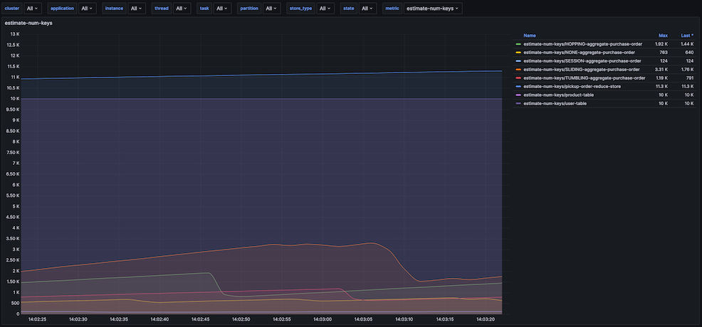

### 12 - Task Ratio

* The time a given task is running within the stream thread.
* Each stream thread is displayed in its own panel.
* For this application, this information hasn't been the most useful; not sure if
more sampling is needed to get a better display of data, or if it is just the nature of this metric.

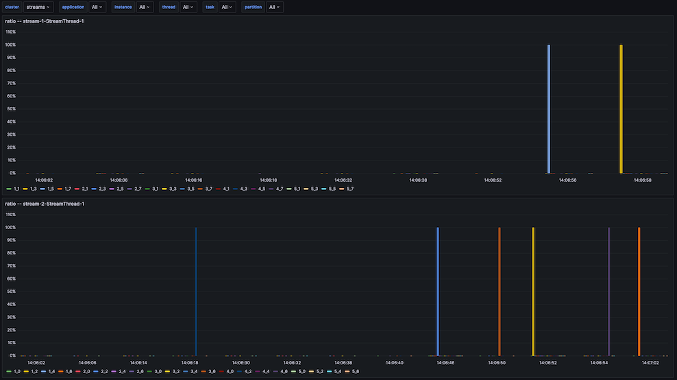

## Docker 

* This project leverages docker and docker compose for easy of demonstration.

* to minimize having to start up all components, separate `docker-compose.yml` for each logical-unit and a common bridge network `ksd`.

* docker compose `.env` files used to keep container names short and consistent but hopefully not clash with any existing docker containers you are using.

### Applications
 
  * one docker image is built to run all of the java applications.
  * The `.tar` file built leverating the gradle `assembly` plugin is mounted, such as:
    * `- ./{application}-1.0.tar:/app.tar`
  * To improve application start time, the .jar files of `kafka-clients` and `kafka-streams` are added to the docker image
  and removed from the `.tar` file.
  * the `entrypoint.sh` will extract the tare file and then move the pre-loaded .jar files into the gradle assembly structure.
  * The size of the `rocksdb` jar is the biggest impact; and a dramatic startup time as a result.

### Kafka Cluster

Apache Kafka Clients communicate directly with each broker, and it is up to the broker to tell the client its host & port for communication. This
means that each broker needs a unique address for communication. Within docker, this means that each broker needs a unique localhost:port so any
application running on your local machine can talk to each broker independently.

  | broker   | internal (container) bootstrap-servers | external (host-machine) bootstrap-servers |
  |---|---|---|
  | broker-1 | broker-1:9092 | localhost:19092                        |
  | broker-2 | broker-2:9092 | localhost:29092                        |
  | broker-3 | broker-3:9092 | localhost:39092                        |
  | broker-4 | broker-4:9092 | localhost:49092                        |

This is not the case for broker-discovery, that discovery can be generalized, but since Kafka communicates the brokers access information within
the broker metadata, it must always have the scenario as shown above.

Currently, each `broker-1` in each cluster will add a port mapping of 9092 to the 19092, allowing for `bootstrap.servers=localhost:19092` or `bootstrap.servers=localhost:9092`.
So if you see this extra mapping in the `broker-1` entry in the clusters, it is there only to aid in the initial connection the client makes to the cluster, one of the first
messages returned will be a `metadata` response that will include the topics/partitions needed to communicat to the various `topic-partition` the client
needs to send data to or read data from.

```yaml
      - '19092:19092'
      - '9092:19092'
```

* The Kafka applications can run on the host machine utilizing the external names, the applications
can run in containers using the internal hostnames.

  * To see the Kafka Streams applications in the dashboard, they must be running within the same network; the `applications` project does this.

  * Each application can have multiple instances up and running, there are 4 partitions for all topics, so for instances are possible.

  * A single Docker image is built to run any application, this application has the JMX Prometheus Exporter rules as part of the container,
it also has a health-check for Kafka streams that leverages jolokia and the `kafka-metrics-count` metric.

  * To improve startup time of the applications, the Docker image preloads the jars for `kafka-clients` and `kafka-streams` and excludes
them from the distribution tar. with RocksDB being a rather large jar file, this has shown to greatly improve startup time as the
image needs to untar the distribution on startup.

  * To reduce build times, the Docker image is only built if it doesn't exist or if `-Pforce-docker=true` is part of the build process. 

### Monitoring

* The monitoring related containers are in the `monitoring` docker-compose, and leverages the prometheus agent for obtaining metrics.

## Development Notes

### OpenSource libraries

These applications are build with the following open-source libraries.

* kafka-streams
* kafka-clients
* jackson
* lombok
* slf4j-api
* logback
* quartz
* undertow
* apache-commons-csv
* apache-commons-lang3
* jcommander

### Lombok

While I do not use `lombok` for enterprise applications, it does come in handle for demonstration projects to minimize on the boiler-plate code that is shown.

### Framework

* Kafka Streams is a framework, there is no need to use an additional framework. 
* Always good to learn now to use the Kafka libraries w/out additional frameworks.

### Tools

* See Tools [README](./tools/README.md) for the benefits this can provide.