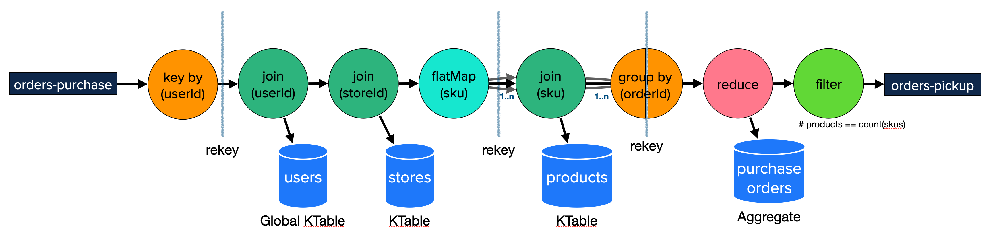

# Kafka Streams Dashboards

## TL;TR
* Setup and Configuration all in the `./scripts/startup.sh` script; execute from root directory to get everything running.
* Select `(1) cluster-1` or `(2) cluster` for your first exploration of this project.
* Goto [localhost:3000](http://localhost:3000) to explore the dashboards.
  * you shouldn't need to log in, but if you need to the username is `admin` and the password is `grafana`.
* Goto [localhost:8888](http://localhost:8888) to explore the contents of the aggregates.
* `./scripts/teardown.sh` will shut everything (regardless of which cluster was selected) and will also remove all volumes.

## Overview
This project showcases Kafka Stream Metrics by deploying 2 types of applications and then dashboards available to monitor them.

## Purchase Order Application

The first application is a "purchase order" system that takes orders, attaches stores and users, and prices them, and emits
the result as a "pickup order". This showcases KTables, Global KTables, Joins, and an aggregation.

The primary stream of data flowing for purchase-order is shown in this diagram. The topology to hydrate and use the tables, is not shown.
This is a logical representation of the topology based on the DSL components, the actual topology built includes additions source and
sink nodes to handling the rekey process. 


_Purchase Order Application_

## SKU Analytic Application

The second application is analytics on the SKU purchased in those orders. It tracks the rekeyed order by SKU and builds
up windowed analytics. This includes all window types: `tumbling`, `hopping`, `sliding`, `session`, and even `none` as a non-window
solution. This aggregations are tracking the quantity purchased on the given SKU for the given type of window. Now, from 
a real-world use-case scenario, I wouldn't use `session` windows for such aggregation; but having the same application with all
windowing options makes it a lot easyer to see and compare the metrics between them.

This project:
* extensively leverages Docker and Docker Compose.
* Applications are built with Java 17 and run on a Java 17 JVM.
* Kafka leverages Confluent Community Edition containers, which run with a Java 11 JVM.
* Has Grafana dashboards for Kafka Cluster, Kafka Streams, Consumer, and Producer.
  * Supports a variety of cluster configurations to better showcase the Kafka Cluster metrics and validate dashboards are build
with the various options.

## sss

  * You will be prompted to select the Apache Kafka instance to run. In addition to kafka stream metrics, there
are complete dashboards for kafka brokers and controllers, and the various clusters provide seeing how dashboards
are impacted for each cluster. The Hybrid cluster is to ensure that the dashboards correctly handle the kafka
node types of `broker`, `controller`, and `broker, controller` successfully.
  * The `cluster-lb` is used to allow for adding network delays to/from a particular broker; this is an advance configuration.
  * The `cluster-sasl` is to allow for the dashboards around authentication to have content; certificates needs to be generated;
see the [readme](./cluster-sasl/certificates/README.md) in cluster-sasl/certificates.
  * Here is the current configuration, but please use the scripts display, to ensure that it hasn't been updated (without a document refresh here).

```
1. cluster-1       --  1 node (broker and controller)
2. cluster         --  4 brokers, 1 raft controller
3. cluster-3ctrls  --  4 brokers, 3 raft controllers
4. cluster-hybrid  --  4 brokers, 1 dedicated raft controller, 2 brokers are also kraft controllers
5. cluster-zk      --  4 brokers, 1 zookeeper controller
6. cluster-sasl    --  4 brokers with SASL authentication, 1 zookeeper controller
7. cluster-lb      --  4 brokers, 1 raft controller, an nginx lb (9092)
```

* Shut it all down, use `./scripts/teardown.sh` script. This will also remove all volumes.

* State Store UI

  * `https://localhost:8888`
  * There are two pages to allow for inspection of the purchase-order state store and aggregate state store.
  * This allows for learning about state stores and windowing.
  
* Grafana Dashboard 

  * `https://localhost:3000`
  * Credentials:
    * username: `admin`
    * password: `grafana`

## Dashboards

There are 9 Kafka Streams dashboards as part of this project.

### 01 - Topology

* This dashboard will give you insights into the Kafka Streams Topology along  with the instance/thread a task is assigned.
* Aids greatly in understanding the task_id (subtopology_partition) used by other dashboards.


### 02 - Threads

 * Process, Commit, Poll statistics on each thread.
 * The graph will keep thread/instances separated while the number is total (of what is selected).


### 03 - Tasks
### 04 - Tasks 2E2
### 05 - Processes
### 06 - Processes 2E2
### 07 - Record Cache
### 08 - StateStore (put/fetch/delete/size)

* Shows the put, get/fetch, delete, and count statistics into a single dashboard.


### 09 - StateStore


## Docker 

* This project leverages docker and docker compose for easy of demonstration.

* to minimize having to start up all components, separate `docker-compose.yml` for each logical-unit and a common bridge network `ksd`.

* docker compose .env files used to keep container names short and consistent but hopefully not clash with any existing docker containers you are using.

* Kafka Brokers name/ports

  | broker   | internal (container) bootstrap-servers | external (host-machine) bootstrap-servers |
  |---|---|---|
  | broker-1 | broker-1:9092 | localhost:19092                        |
  | broker-2 | broker-2:9092 | localhost:29092                        |
  | broker-3 | broker-3:9092 | localhost:39092                        |
  | broker-4 | broker-4:9092 | localhost:49092                        |

* The Kafka applications can run on the host machine utilizing the external names, the applications
can run in containers using the internal hostnames.

  * To see the Kafka Streams applications in the dashboard, they must be running within the same network; the `applications` project does this.

  * Each application can have multiple instances up and running, there are 4 partitions for all topics, so for instances are possible.

  * A single Docker image is built to run any application, this application has the JMX Prometheus Exporter rules as part of the container,
it also has a health-check for Kafka streams that leverages jolokia and the `kafka-metrics-count` metric.

  * To improve startup time of the applications, the Docker image preloads the jars for `kafka-clients` and `kafka-streams` and excludes
them from the distribution tar. with RocksDB being a rather large jar file, this has shown to greatly improve startup time as the
image needs to untar the distribution on startup.

  * To reduce build times, the Docker image is only built if it doesn't exist or if `-Pforce-docker=true` is part of the build process. 

## In addition to Kafka Streams Metrics, this project has examples on best-practices for working with Kafka Streams and building out some ideas of making your deployments easier.

  * leaving group on close, even with stateful-sets
  * how to use environment variables to overide stream settings
  * naming your processors
  * naming your state-stores

## OpenSource libraries

* kafka-streams
* kafka-clients
* jackson
* lombok
* slf4j-api
* logback
* quartz
* undertow
* apache-commons-csv
* apache-commons-lang3
* jcommander

While I do not use `lombok` for enterprise applications, it does come in handle for demonstration projects to minimize on the boiler-plate code that is shown.

## Tools

The tools project provides custom deserializers to use to inspect key elements on a change-log topic.

* `scripts/enable-custom-tools-derserialer` will create a symbolic link to the tools jar file. This allows
for `kafka-console-consumer` to utilize those deserializers.  Inspect the script before running, to understand
the modification it will do (expecially if your installation of Apache Kafka is not Confluent's.)

```
kafka-console-consumer \
   --bootstrap-server localhost:19092 \
   --property print.timestamp=true \
   --property print.partition=true \
   --property print.key=true \
   --property key.separator=\| \
   --key-deserializer=io.kineticedge.ksd.tools.serde.SessionDeserializer \
   --topic analytics_session-SESSION-aggregate-purchase-order-changelog
```